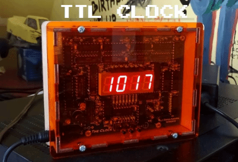
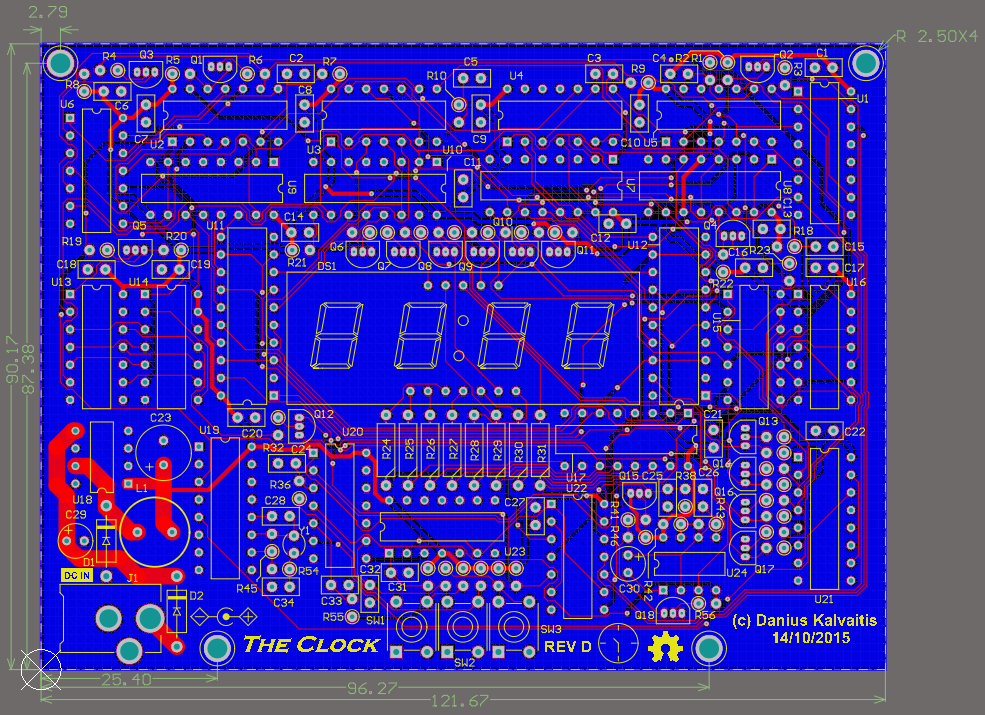
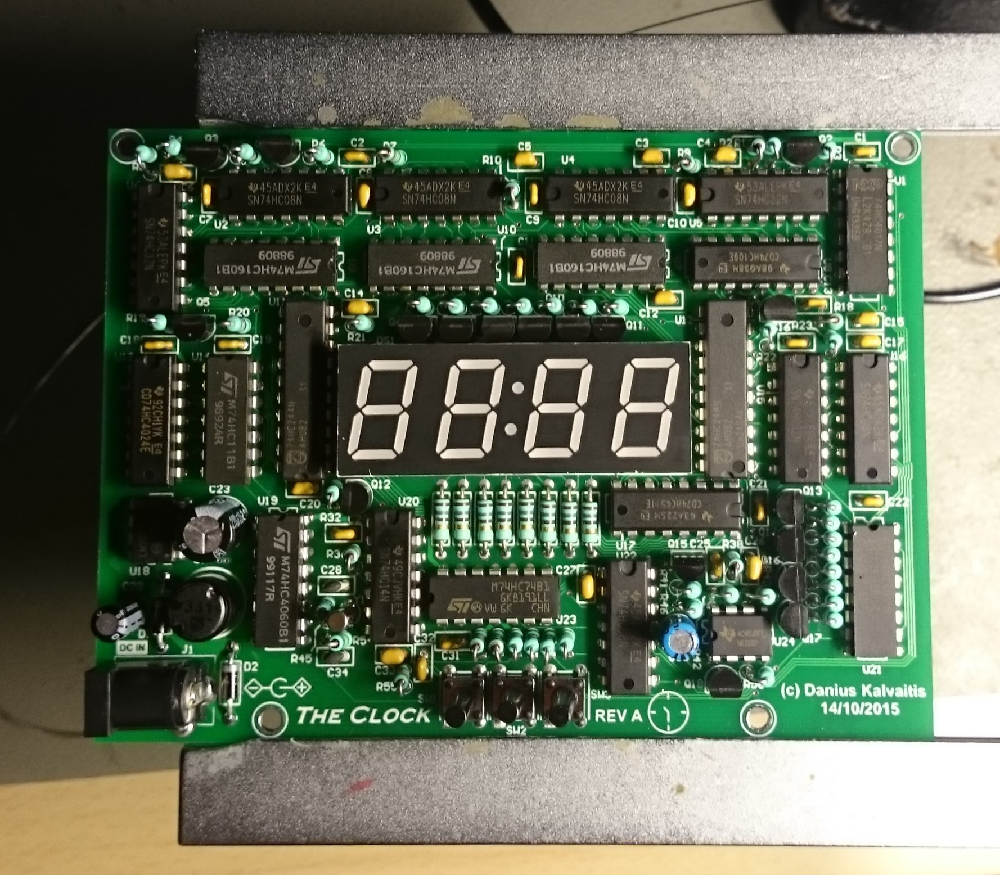
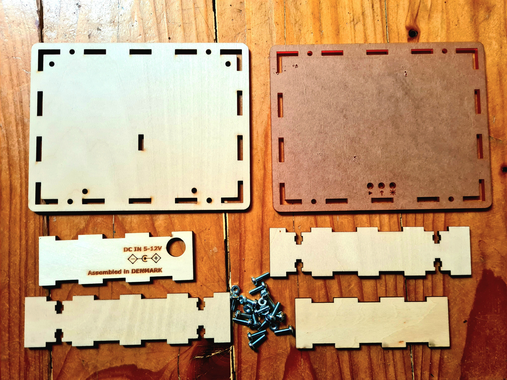
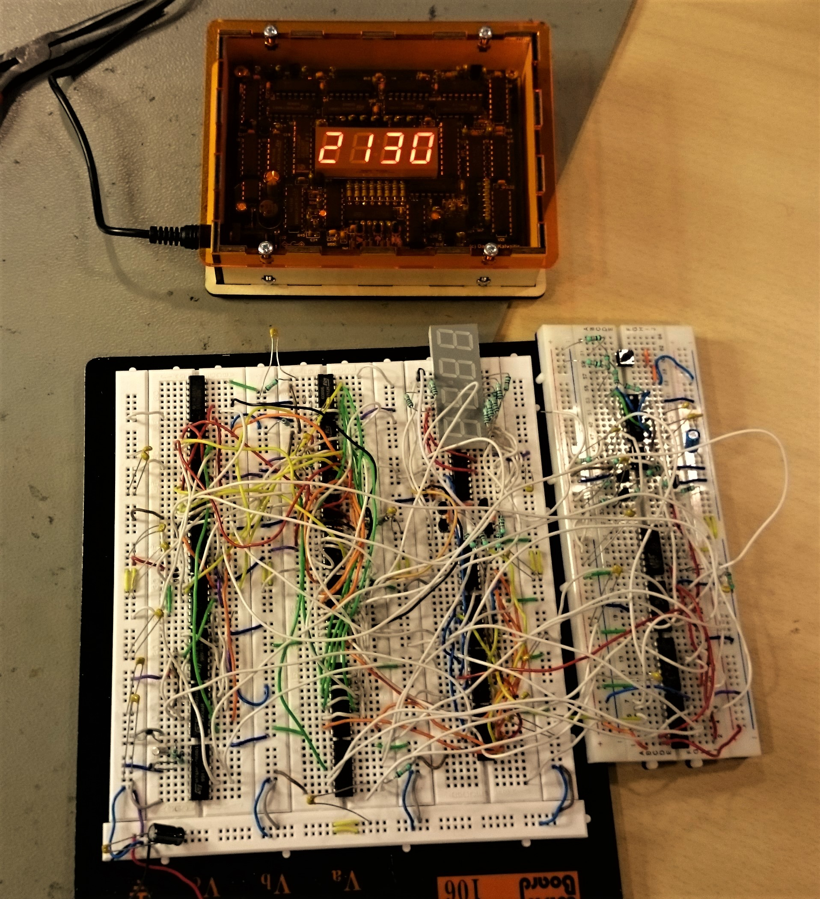

An old school digital clock made using transistor-transistor logic chips: counters, logic gates, flip-flops and other integrated circuits. Project started out as a small task during my Electronics Engineering studies, but I got really interested in digital logic circuits and gave myself a challenge to create a fully functioning digital clock. As amount of features grew so did the circuit complexity allowing me to learn a lot about digital circuits. 

## Overview
Clock is sourced from a 32.768kHz crystal and then via counters frequency is reduced to hours, minutes and seconds. Outputs from counters are connected via buffers to a multiplexing circuit that drives a 4 digit 7-segment display. Multiplexing reduces display current consumption by ~4 times as only one digit is actually displayed at a time. Display brightness doesn't actualy get reduced by much, almost indistinguishable visualy and the chip count remains the same.

## User Interface
There is a simple 3 button UI:

- 1st button - click to turn on/off display, internal clock remains running
- 2nd button - click to enter time setting mode, the first digit on display starts blinking and the number can be incremented via third button. Every following click will change the digit being set to next. When the button is clicked last time clock starts running from second 0 on the set minute, the display stops blinking and is showing current time.
- 3rd button - only operational when in time setting mode. Click to increment current digit by one. Hold to continiously increment current digit.

## Power
Power is supplied from an external AC-DC adapter. 5V to 20V wide input voltage range for flexibility.

## Shematic
Here is the final [schematic](TTL%20Clock.pdf).

## Printed Circuit Board
PCB is standard 2-layer 1.6mm with through-hole components only.

## Assembly
It's best to start out with resistors, transistors and other discrete components first. Then ICs and remaining components. Assembly process normally takes about 5 hours.

## Enclosure
Enclosure is designed to be laser cut. Assembles easily with just a few screws, nuts and standoffs. [TTL Clock Enclosure Bottom.svg](Enclosure/TTL%20Clock%20Enclosure%20Bottom.svg) is to be cut out of 4mm plywood and [TTL Clock Enclosure Top.svg](Enclosure/TTL%20Clock%20Enclosure%20Top.svg) is to be cut out of 3mm plexiglass (feel free to try different colors).

## Prototype
I prototyped and tested the circuit on a breadboard. Comparing prototype size to the final PCB size shows how much circuit density is packed on the final layout.

